<div align="center">

[中文](README.md) | **English**


# Abu (阿布)

**Your AI Desktop Office Assistant — Just Leave It to Abu**

A locally-run AI desktop assistant inspired by Claude Code's Cowork mode.
Tell Abu what you need — it reads files, runs commands, writes docs, and builds reports, all on your machine.

[](https://github.com/PM-Shawn/Abu-Cowork/releases)
[](LICENSE)

[Download](#-download) · [Quick Start](#-quick-start) · [Features](#-features) · [User Guide](docs/User-Guide_EN.md) · [Build from Source](#-build-from-source)

</div>

---

## Preview

> Clean interface, powerful capabilities

<table>
<tr>
<td align="center" width="50%"><b>Welcome</b><br/>Natural language input — conversation is the command<br/><br/>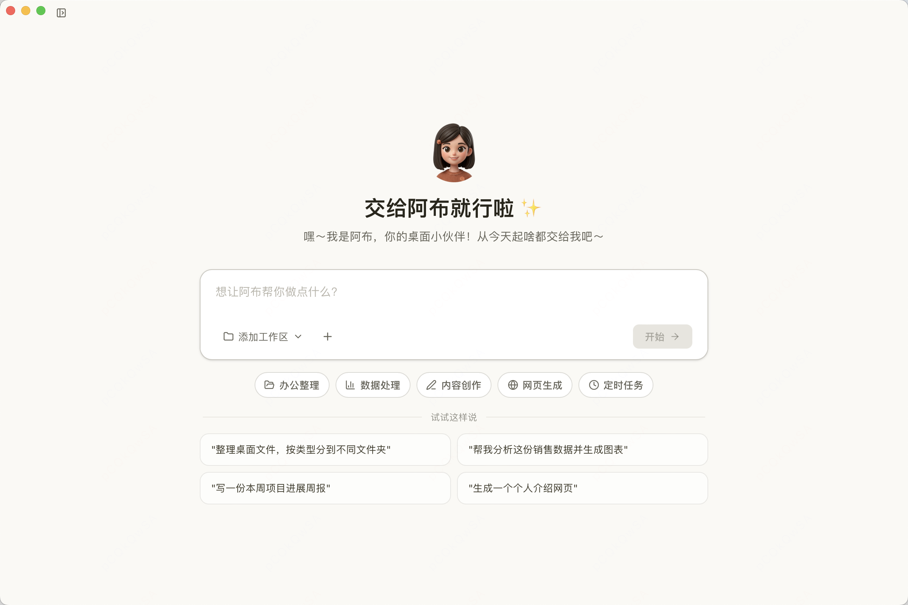</td>
<td align="center" width="50%"><b>Task Execution</b><br/>Autonomous planning & tool invocation for complex tasks<br/><br/>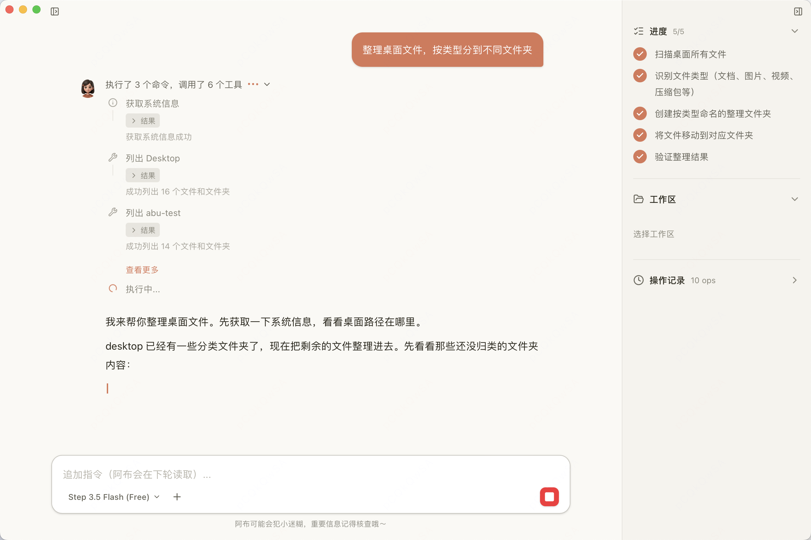</td>
</tr>
<tr>
<td align="center"><b>Permission Control</b><br/>File access requires user authorization<br/><br/>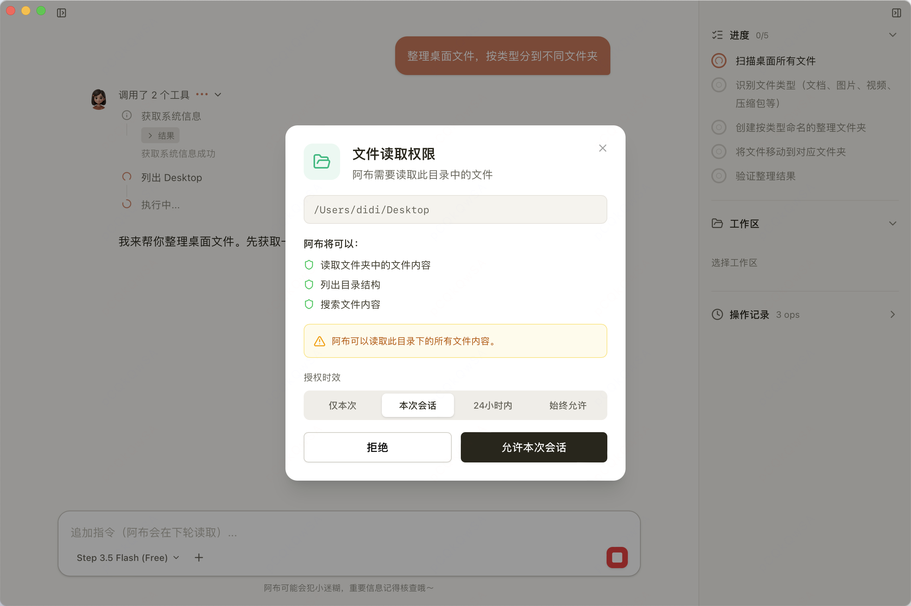</td>
<td align="center"><b>IM Channel Chat</b><br/>@Abu in Lark/DingTalk to interact<br/><br/>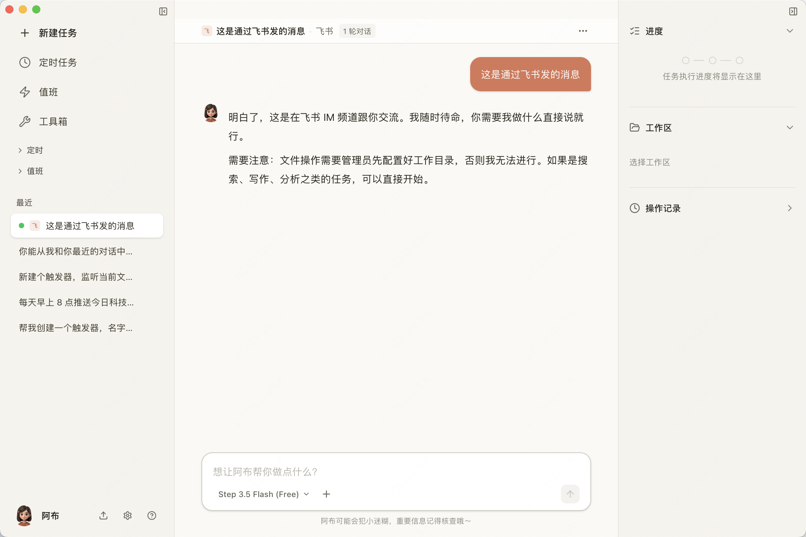</td>
</tr>
<tr>
<td align="center"><b>Skills</b><br/>20+ built-in skills, fully customizable<br/><br/>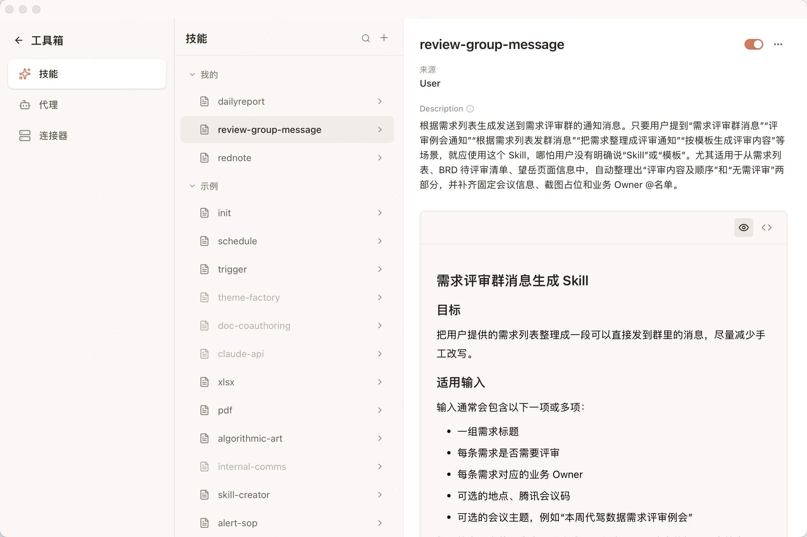</td>
<td align="center"><b>MCP Connectors</b><br/>One-click integration with Playwright, GitHub & more<br/><br/>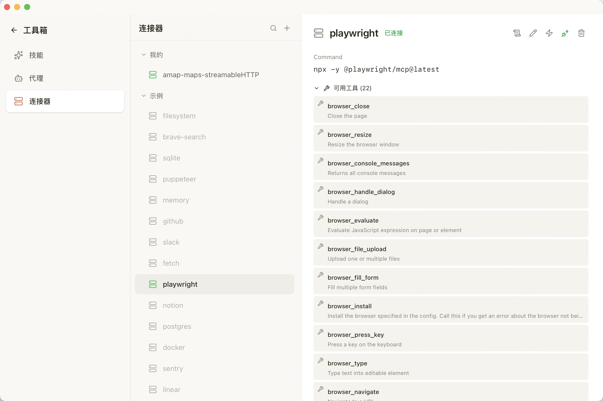</td>
</tr>
<tr>
<td align="center"><b>Scheduled Tasks</b><br/>Cron-based scheduling for automated workflows<br/><br/></td>
<td align="center"><b>Triggers / Watch</b><br/>HTTP, file changes, IM messages auto-trigger tasks<br/><br/>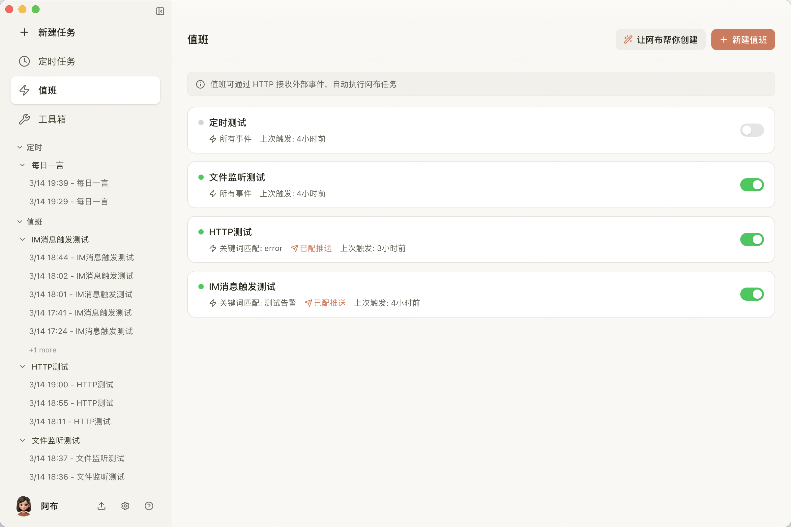</td>
</tr>
<tr>
<td align="center"><b>AI Service Config</b><br/>Multi-provider model support, easy switching<br/><br/>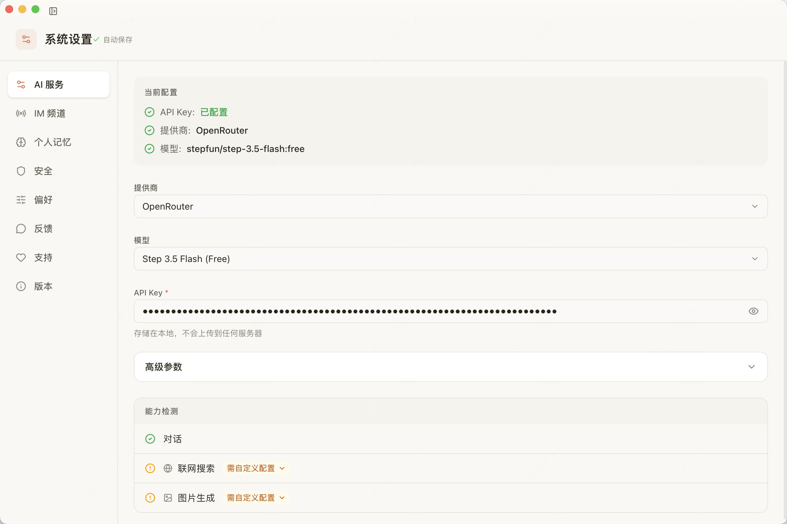</td>
<td align="center"><b>IM Channel Config</b><br/>Connect Lark, DingTalk, WeCom & more<br/><br/>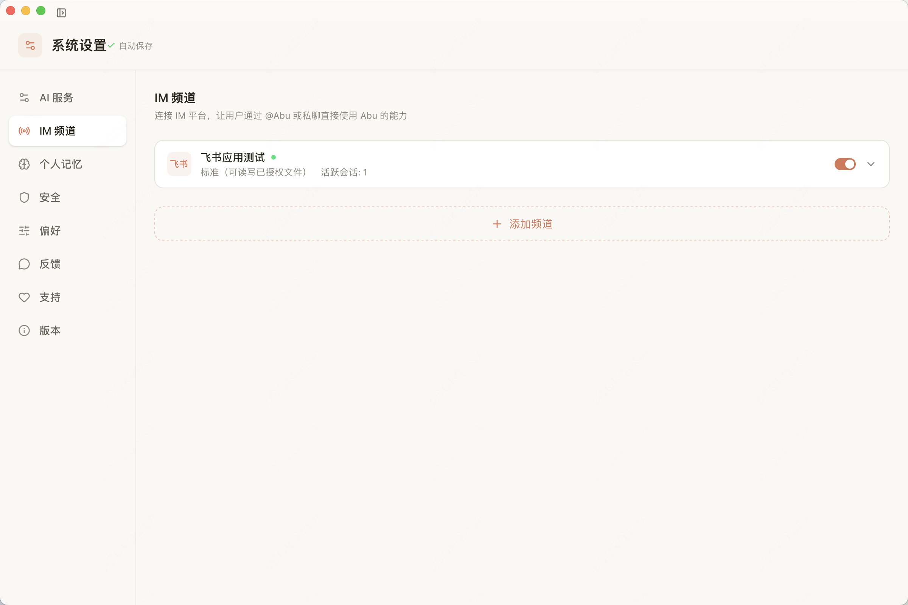</td>
</tr>
<tr>
<td align="center"><b>Personal Memory</b><br/>Remembers your preferences and work habits<br/><br/>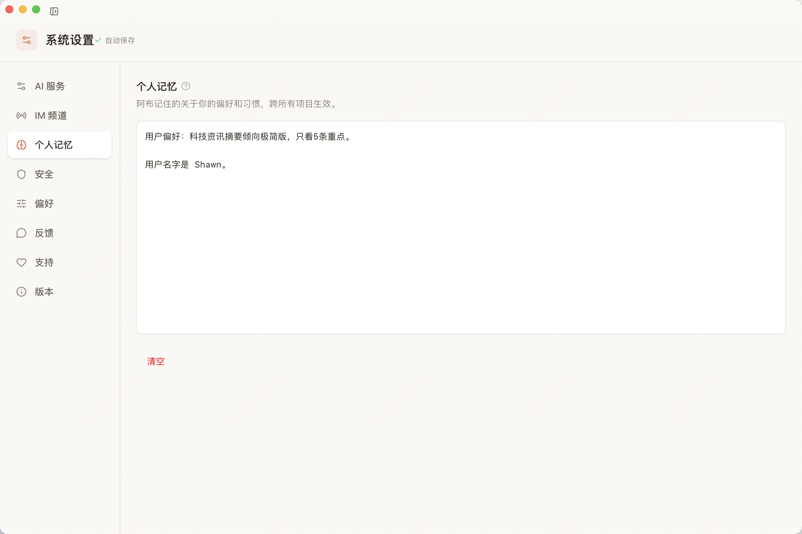</td>
<td align="center"><b>Security Sandbox</b><br/>Seatbelt sandbox + network isolation for privacy<br/><br/>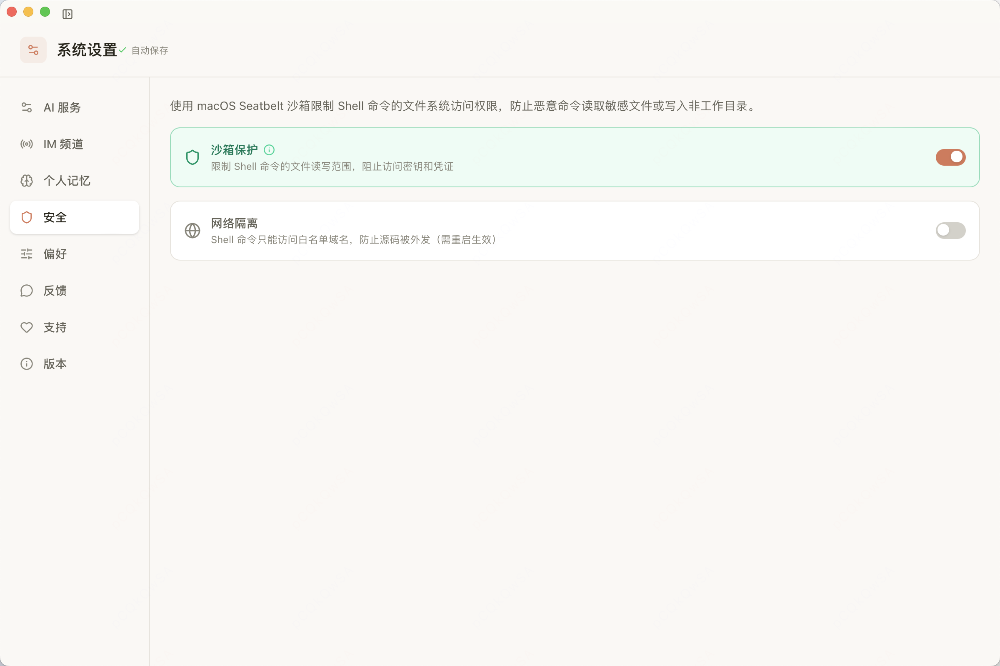</td>
</tr>
</table>

## Features

### Core

- **Autonomous Agent** — More than chat: plans, invokes tools, reads/writes files, executes commands, and completes complex tasks
- **Skill System** — 20+ built-in skills (translation, weekly reports, code review, deep research, doc writing, and more) — one-click install, fully customizable
- **MCP Protocol** — Connect to databases, search engines, GitHub, and other external services via Model Context Protocol
- **Multi-Model Support** — Works with Anthropic Claude, DeepSeek, Qwen, Doubao, Moonshot, GLM, and other major LLM providers

### Automation & Triggers

- **Scheduled Tasks** — Cron-based scheduling (e.g., daily AI news digest at 9 AM)
- **Trigger System** — Multiple event sources to automatically invoke agents:
  - **File Watcher** — Monitor file create/modify/delete events with glob patterns
  - **HTTP Webhook** — Auto-generated POST endpoints for external callbacks
  - **IM Messages** — Trigger tasks on specific incoming messages
  - **Cron Schedule** — Periodic execution on a time-based plan
- **Trigger Permission Model** — Four capability levels (read-only → safe tools → full access → custom whitelist) for fine-grained control over automated tasks

### IM Channel Integration

Turn Abu into your team bot — just @Abu in your chat:

- **Supported Platforms** — D-Chat, Feishu (Lark), DingTalk, WeCom, Slack
- **Session Management** — Auto-isolate conversations by user/group/thread, auto-archive on timeout, "continue last" recovery
- **Security Controls** — User allowlist, workspace path restrictions, capability level enforcement
- **Response Modes** — Mention-only or all-messages

### Memory & Context

- **Personal Memory** — Abu remembers your preferences and work habits (`~/.abu/agents/memory.md`)
- **Project Memory** — Auto-maintained project-level context (`{workspace}/.abu/MEMORY.md`)
- **Project Instructions** — Manually configure project-specific rules (`{workspace}/.abu/ABU.md`)

### Browser Integration

- **Browser Bridge** — MCP Server connecting to Chrome for web automation
- **Chrome Extension** — Works with Abu for element clicking, form filling, screenshots, JS execution, and more

### Security & Privacy

- **Sandbox Security** — macOS Seatbelt sandbox isolation + sensitive path protection + command safety checks
- **Local-First** — Your data stays local, your API keys stay local — nothing goes through third-party servers
- **Cross-Platform** — Supports macOS (Apple Silicon / Intel) and Windows

> For detailed feature documentation, see the [User Guide](docs/User-Guide_EN.md)

## Download

Head to [GitHub Releases](https://github.com/PM-Shawn/Abu-Cowork/releases) to download the latest version:

| Platform | File |
|----------|------|
| macOS (Apple Silicon) | `Abu_x.x.x_aarch64.dmg` |
| macOS (Intel) | `Abu_x.x.x_x64.dmg` |
| Windows | `Abu_x.x.x_x64-setup.exe` |

> **macOS Users**: If you see a "damaged" warning on first launch, run `xattr -cr /Applications/Abu.app`. See the [Installation Guide](docs/Installation-Guide_EN.md) for details.

## Quick Start

1. Download, install, and open Abu
2. Click the settings icon at the bottom left, go to "Custom Models"
3. Choose your API provider and enter your API Key
4. Return to the main screen and start chatting

**Try these prompts:**

```
Organize the files on my desktop by type
```
```
Extract the tables from this PDF and generate an Excel file
```
```
Every morning at 9 AM, search for the latest AI news and generate a daily digest
```

> For more use cases, see the [User Guide](docs/User-Guide_EN.md)

## Tech Stack

| Layer | Technology |
|-------|-----------|
| Desktop Framework | Tauri 2.0 (Rust + Web) |
| Frontend | React 19 + TypeScript + TailwindCSS v4 + Vite |
| LLM | Multi-model adapter (Anthropic / OpenAI-compatible) |
| State Management | Zustand + Immer |
| Tool Protocol | MCP (`@modelcontextprotocol/sdk`) |
| Sandbox | macOS Seatbelt + path/command dual validation |
| UI | Radix UI + Lucide Icons |
| Testing | Vitest + happy-dom |

## Build from Source

### Prerequisites

- Node.js >= 18
- Rust >= 1.75 ([Install Rust](https://rustup.rs/))
- Tauri 2.0 system dependencies ([See docs](https://v2.tauri.app/start/prerequisites/))

### Development

```bash
# Clone the repo
git clone https://github.com/PM-Shawn/Abu-Cowork.git
cd Abu-Cowork

# Install dependencies
npm install

# Launch desktop app (recommended)
npm run tauri dev

# Frontend only (no Rust required)
npm run dev
```

### Build

```bash
npm run tauri build
```

Build artifacts are located in `src-tauri/target/release/bundle/`.

### Testing

```bash
npm test              # Run tests
npm run test:watch    # Watch mode
npm run test:coverage # Coverage report
npm run lint          # ESLint check
```

## Project Structure

```
src/
├── components/       # React UI components
│   ├── chat/         # Chat interface, message bubbles, Markdown rendering
│   ├── sidebar/      # Sidebar navigation
│   ├── panel/        # Right-side detail panel
│   ├── schedule/     # Scheduled task views
│   ├── trigger/      # Trigger management views
│   ├── settings/     # System settings (incl. IM channel config)
│   └── ui/           # Base UI components (shadcn/Radix)
├── core/             # Core engine (non-UI)
│   ├── agent/        # Agent loop, retry, memory system
│   ├── llm/          # LLM adapter layer (Claude + OpenAI-compatible)
│   ├── tools/        # Tool registry, built-in tools, safety checks
│   ├── mcp/          # MCP client
│   ├── skill/        # Skill loading & preprocessing
│   ├── scheduler/    # Scheduling engine
│   ├── trigger/      # Trigger engine (file watcher/webhook/cron/IM)
│   ├── im/           # IM channel adapters (D-Chat/Feishu/DingTalk/WeCom/Slack)
│   ├── context/      # Context management & token estimation
│   └── sandbox/      # Sandbox configuration
├── stores/           # Zustand state management
├── hooks/            # React Hooks
├── i18n/             # Internationalization (Chinese / English)
├── types/            # TypeScript type definitions
└── utils/            # Utility functions

builtin-skills/       # Built-in skill definitions (translation, reports, code review, etc.)
builtin-agents/       # Built-in agent definitions
abu-browser-bridge/   # Browser bridge MCP Server
abu-chrome-extension/ # Chrome extension
src-tauri/            # Tauri Rust backend (sandbox, command execution, network proxy)
```

## Documentation

| Document | Description |
|----------|-------------|
| [User Guide](docs/User-Guide_EN.md) | Complete product features and usage instructions |
| [Installation Guide](docs/Installation-Guide_EN.md) | Platform-specific installation and troubleshooting |

## Contributing

Issues and Pull Requests are welcome!

1. Fork this repo
2. Create your branch: `git checkout -b feat/my-feature`
3. Commit your changes: `git commit -m 'feat: add my feature'`
4. Push to the branch: `git push origin feat/my-feature`
5. Open a Pull Request

## Feedback & Community

Got questions or ideas? Scan the QR code to join the WeChat group:


## Support

If Abu has been helpful to you, feel free to buy the author a coffee:


## License

[Abu License](LICENSE) — Free for personal, educational, and non-commercial use. Copyright notices must be retained and may not be modified or removed. Commercial use requires authorization. See [LICENSE](LICENSE) for details.
